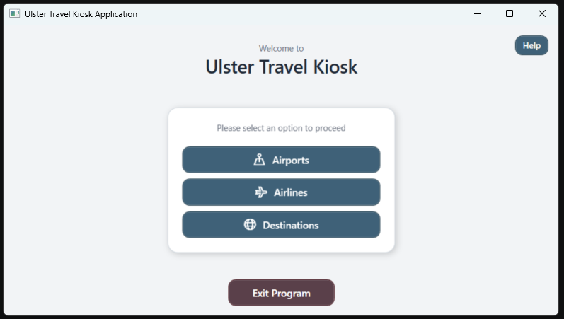
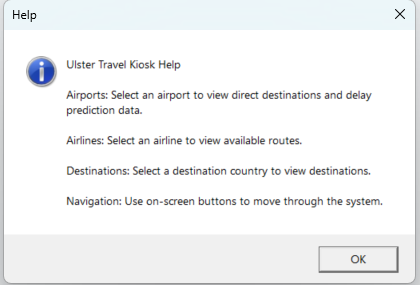

# Ulster Travel Kiosk Application

## Overview

The Ulster Travel Kiosk Application is a desktop application built using C# and WPF on .NET 8. The project was developed as part of a Computing course project and simulates a travel kiosk system that allows users to browse travel information, routes, destinations, airlines, and delay predictions through an interactive graphical interface.

The application follows a layered architecture with separate class library and UI projects, helping improve maintainability and scalability.

---

## Features

* Browse travel destinations
* View airport and airline information
* Route management functionality
* Delay prediction data integration
* Admin login and management screens
* Logging system for tracking application activity
* CSV-based data storage
* Modern WPF user interface using Material Design components

---

## Screenshots

### Home Screen


### Home Help Screen


### Admin Screen


## Admin Screen (Credentials)


---

## Technologies Used

* C#
* .NET 8
* WPF
* XAML
* Material Design in XAML Toolkit
* FontAwesome.WPF
* CSV Data Storage
* Git & GitHub

---

## Project Structure

```bash
UlsterTravelKioskApplication/
│
├── UlsterTravelKioskApplication/        # Core business logic and services
│   ├── Models/
│   ├── Services/
│   └── Data/
│
├── UlsterTravelKioskApplication.UI/     # WPF user interface
│   ├── Screens/
│   ├── Admin/
│   └── Assets/
│
└── UlsterTravelKioskApplication.sln
```

---

## Key Components

### Models

Contains the application's data models including:

* Airlines
* Airports
* Routes
* Destinations
* Delay Predictions
* Logging
* Settings

### Services

Handles the application's business logic and data processing:

* Data management
* API processing
* Delay prediction services
* Logging services
* Password hashing
* Administrative functionality

### UI Layer

The WPF UI project provides:

* Interactive travel kiosk screens
* Administrative management panels
* Login functionality
* Material Design styling

---

## Installation & Setup

### Requirements

* Visual Studio 2022
* .NET 8 SDK
* Windows OS

### Running the Application

1. Clone the repository:

```bash
git clone https://github.com/kaitlyndeschner/UlsterTravelKioskApplication.git
```

2. Open the solution file:

```bash
UlsterTravelKioskApplication.sln
```
cd
3. Restore NuGet packages

4. Build and run the application using Visual Studio

---

## Learning Outcomes

This project helped develop skills in:

* Event-driven programming
* Desktop application development
* WPF and XAML UI design
* Application architecture
* Data management
* Git version control
* Software debugging and testing
* Working with external packages and libraries

---

## Future Improvements

Potential future enhancements include:

* Database integration using SQL Server
* Real-time API integration for live travel data
* Improved authentication and security
* Enhanced UI/UX animations and responsiveness
* Advanced analytics and reporting
* Cloud-based data storage

---

## Author

Kaitlyn Deschner

Computing Student & Software Developer

---

## License

This project was created for educational purposes.
